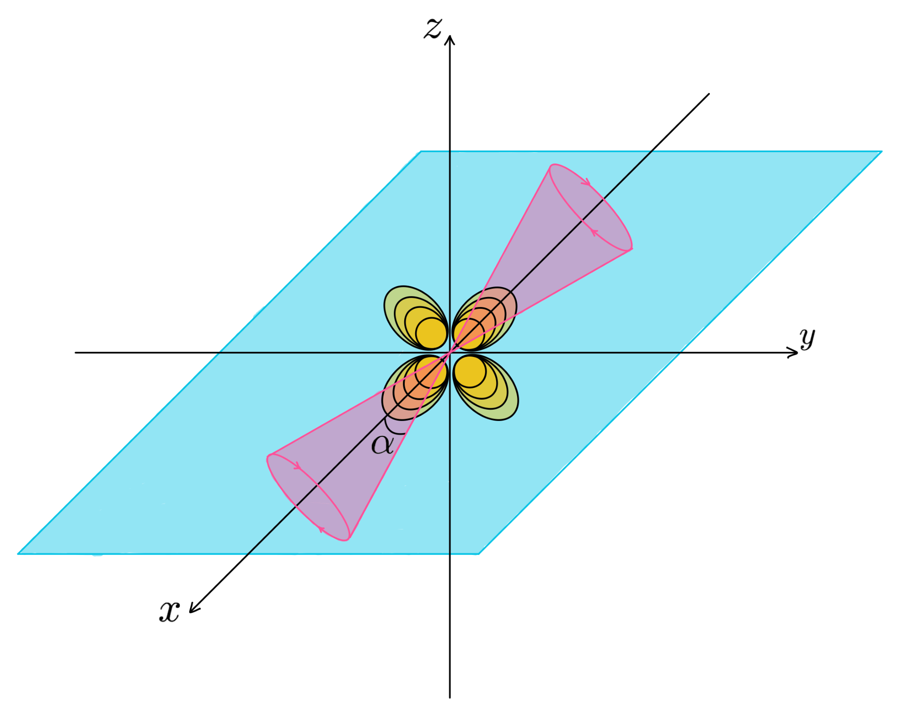
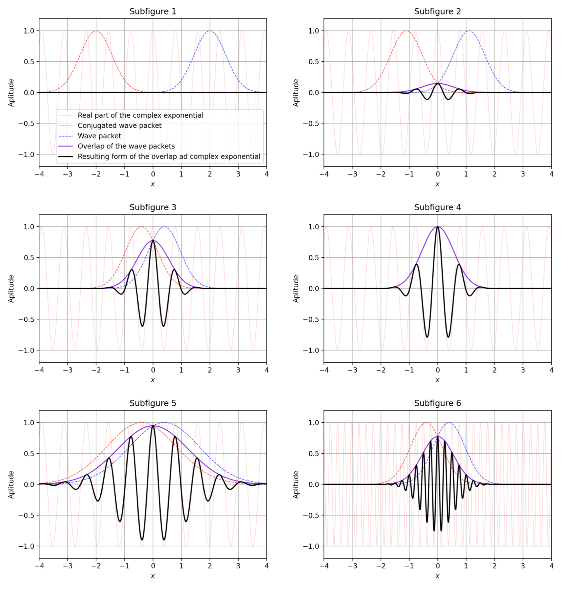
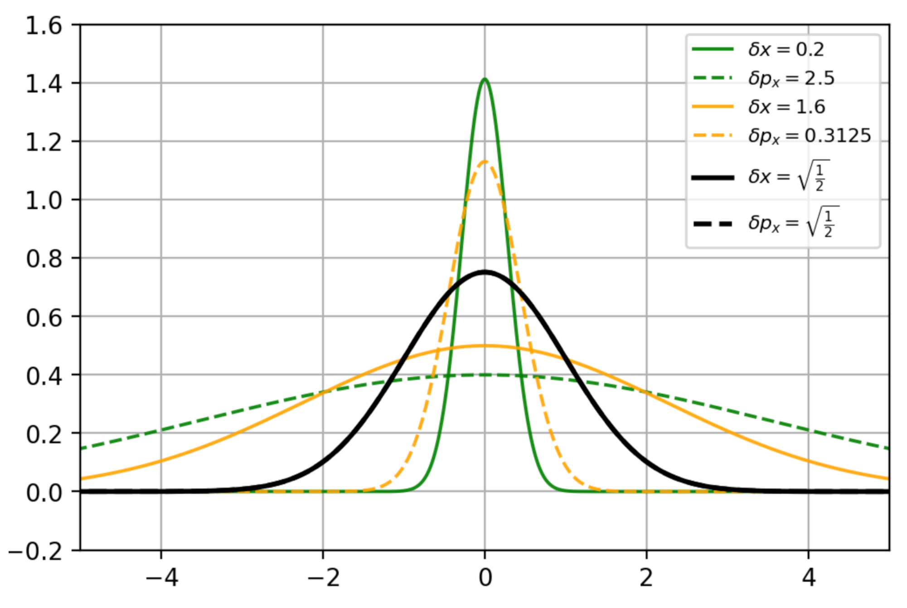
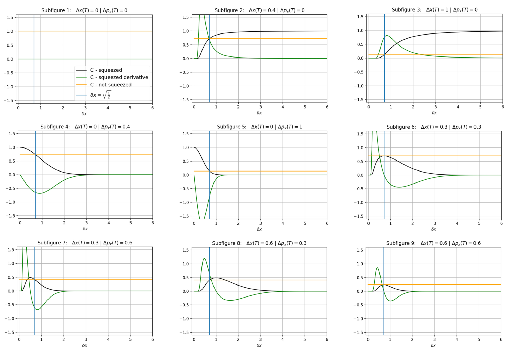

# BSc Physics Thesis

## Humpty Dumpty: Coherence Measure and QGEM Protocol

**Vlad-Haralambie Ispas**  
BSc Physics  
University of Groningen, 2021

**Supervisors:** Prof. Anupam Mazumdar and Prof. Emanuela Dimastrogiovanni

[**View the full thesis (PDF)**](./BScPThesis_Vlad_Haralambie_Ispas.pdf)

---

## Abstract

A Stern–Gerlach interferometer separates a particle's spin components into different spatial paths and subsequently recombines them. Recovering the original spin coherence requires the two resulting wave packets to match at the quantum level: bringing their average positions together is not sufficient if their momenta or relative phase profiles remain distinguishable. This is the **Humpty Dumpty problem** of spin interferometry.

This thesis reconstructs the coherence calculation developed by Englert, Schwinger and Scully, explaining its mathematical steps and physical interpretation in the context of **quantum-gravity-induced entanglement of masses (QGEM)**. The central treatment considers a spin-½ particle, an approximately conserved spin component along the splitting axis, and Gaussian motional states.

Starting from the Hamiltonian and Heisenberg equations, I derive the spin-conditioned displacements and connect them to the final spin coherence through wave-packet overlap. The Gaussian result makes the recombination requirement quantitative: coherence is exponentially sensitive to residual position and momentum mismatch relative to the corresponding quantum uncertainties.

The analysis then examines **squeezed preparations**, showing why squeezing can either improve or reduce coherence depending on the remaining mismatch, and discusses additional magnetic-field components and longitudinal effects. The work provides an analytical account of what must be controlled within an individual interferometer before coherent spatial superpositions can be used in a QGEM experiment.

## Physical setting

The splitting direction is chosen as **x**. A magnetic-field gradient exerts opposite forces on the two spin projections, separating their motional states. Subsequent stages reverse the relative motion and attempt to recombine the paths.

*Coordinate and spin conventions used in the analysis. The two spin projections are defined along x; the transverse spin components describe the observable coherence. Thesis Fig. 2.2, p. 11.*

The reduced model conserves the splitting-axis component $S_x$. The combination $S_+=S_y+iS_z$ therefore provides a convenient way to follow the transverse spin coherence and its phase.

| Part of the model | Purpose |
|---|---|
| Spin-½ particle | Represent two spin-conditioned interferometer paths. |
| Linearised magnetic field | Relate the field gradient to position and momentum displacement. |
| Heisenberg evolution | Derive the operator dynamics and connect them to spin observables. |
| Gaussian wave packet | Evaluate the overlap analytically and identify the relevant quantum scales. |
| Squeezed Gaussian preparation | Examine the trade-off between position and momentum tolerance. |

## Coherence is a phase-space overlap

For an initially coherent spin superposition with a pure motional state, the coherence magnitude is set by the overlap of the two final motional states:

$$
C=\left|\langle\psi_-(T)\mid\psi_+(T)\rangle\right|.
$$

Here, $\psi_\pm$ are the wave packets associated with the two spin projections and $T$ is the final time. A residual mismatch leaves information about the spin branch in the motion, reducing the spin coherence when that motion is not measured.

For the uncorrelated, minimum-uncertainty Gaussian preparation, the displacement-operator calculation gives

$$
C=\exp\!\left[-\frac12\left(\frac{\overline{\Delta x}^{\,2}}{\delta x^2}+\frac{\Delta p_x(T)^2}{\delta p_x^2}\right)\right],\qquad
\overline{\Delta x}=\Delta x(T)-\frac{T}{m}\Delta p_x(T),\qquad
\delta x\,\delta p_x=\frac{\hbar}{2}.
$$

The quantities $\delta x$ and $\delta p_x$ are the initial root-mean-square packet widths, and $m$ is the particle mass. Following the thesis's convention, $\Delta x$ and $\Delta p_x$ are **one-arm shifts**: the full separation between the two branch centres is twice each value.

The barred displacement expresses the mismatch in the **initial wave-packet frame**, removing the common free-propagation shear. This keeps the displacement and packet widths in the same frame; evaluating the overlap at the final time instead requires the corresponding evolved position–momentum covariance. The formulas here retain $\hbar$ explicitly, whereas the thesis uses $\hbar=1$.

*Gaussian overlap result in the displacement convention of thesis Eqs. 5.4.10 and 6.2.6; see §§6.3–6.4 for the Gaussian evaluation.*

The physical consequence is that **both position and momentum must recombine to within the quantum packet widths**. Exact closure in both variables gives unit overlap within this model; a small position residual alone does not establish high coherence.

## Two ways to lose the overlap

Position and momentum mismatch suppress the same coherence measure through different mechanisms:

- **Position mismatch** reduces the spatial overlap of the packet envelopes.
- **Momentum mismatch** creates a varying relative phase across the packets, causing cancellation in the overlap integral even when their envelopes overlap strongly.

*The illustrated overlap integrands distinguish reduced envelope overlap from phase cancellation. The signed oscillations matter because coherence depends on the complex overlap integral, not just the overlap of probability densities. Thesis Fig. 6.1, p. 35.*

This also distinguishes **coherence magnitude from spin direction**. A known overall Larmor phase rotates the transverse spin without reducing the magnitude of its coherence. Recovering the original spin direction requires controlling that phase modulo $2\pi$, in addition to restoring the motional overlap.

## Squeezing: matching the preparation to the mismatch

For a minimum-uncertainty Gaussian, narrowing the position distribution necessarily broadens the momentum distribution, and vice versa. Squeezing therefore changes how strongly the same residual displacement affects coherence.

*Wave-packet amplitudes in position and momentum space change together under the minimum-uncertainty constraint. Thesis Fig. 7.1, p. 37.*

If position mismatch dominates, a broader position distribution can improve the overlap. If momentum mismatch dominates, a broader momentum distribution can help instead. When both residuals are nonzero, neither arbitrarily narrow nor arbitrarily broad position preparation is optimal.

For the uncorrelated minimum-uncertainty family and fixed residual displacements in the initial packet frame, the optimum is

$$
\delta x_{\mathrm{opt}}=\sqrt{\frac{\hbar\,|\overline{\Delta x}|}{2|\Delta p_x(T)|}}.
$$

At this width, the position and momentum terms contribute equally to the coherence exponent. This is the squeezing optimisation studied in Chapter 7, with the phase-space convention made explicit.

*Different residual mismatches favour different packet widths. These are illustrative evaluations of the analytical formula, with the parameter choices used in thesis Fig. 7.2, p. 38; they are not measured interferometer performance.*

The result is a conditional improvement: **squeezing is useful when it is matched to the residual error**, and can worsen coherence when it is applied in the wrong direction or by the wrong amount. The stated optimum is restricted to this uncorrelated Gaussian family and nonzero position and momentum residuals.

## Magnetic-field control and recombination

The equations of motion connect the endpoint mismatch to the history of the spin-dependent force. Writing $F(t)$ for the force on one branch relative to the common motion, the corresponding shifts are

$$
\Delta p_x(T)=\int_0^T F(t)\,dt,\qquad
\Delta x(T)=\frac{1}{m}\int_0^T(T-t)F(t)\,dt.
$$

Momentum closure therefore constrains the **net impulse**, while position closure constrains its **time-weighted integral**. The field sequence must control both quantities. The field component that sets the overall spin-precession phase introduces a further readout requirement.

The thesis also discusses longitudinal Stern–Gerlach displacement and the effect of additional field gradients sampled across a packet's finite extent. These extensions show why a realistic field cannot always be reduced to the splitting-axis gradient alone. Their treatment remains restricted; arbitrary three-dimensional spin dynamics are not solved.

## Main contribution and scope

The main contribution is a detailed **rederivation and physical interpretation** of the established Humpty Dumpty coherence result, followed by an analysis of Gaussian squeezing and selected field-profile extensions. The figures illustrate analytical expressions rather than a numerical prediction for a complete experimental apparatus.

The calculation makes three practical points clear:

1. **Recombination is a quantum phase-space requirement.** Residual position and momentum shifts must be judged against packet uncertainties.
2. **Preparation and control must be considered together.** The useful squeezing direction depends on which mismatch remains after the field sequence.
3. **The two final motional states must match one another.** They need not each reproduce the initial packet shape if their final overlap is preserved.

The principal derivation assumes a linearised field, approximately conserved $S_x$, and the stated Gaussian preparation. It does not include a full environmental-decoherence model or solve the noncommuting transverse spin dynamics. QGEM supplies the motivation; the work does not demonstrate gravity-mediated entanglement experimentally.

## Thesis roadmap

| Chapters | Content |
|---|---|
| **1–2** | Humpty Dumpty background and QGEM motivation. |
| **3–4** | Coherence observables, magnetic fields and model assumptions. |
| **5–6** | Hamiltonian dynamics, spin-conditioned displacements and Gaussian coherence. |
| **7** | Squeezed states and the preparation-width trade-off. |
| **8** | Additional field components and longitudinal dependence. |
| **9–10** | Interpretation, limitations and conclusions. |

Figures are extracted from the [full thesis](./BScPThesis_Vlad_Haralambie_Ispas.pdf). The underlying coherence theory is developed in Englert, Schwinger and Scully's *Is spin coherence like Humpty-Dumpty?* papers, cited as references [1] and [2] in the thesis.
